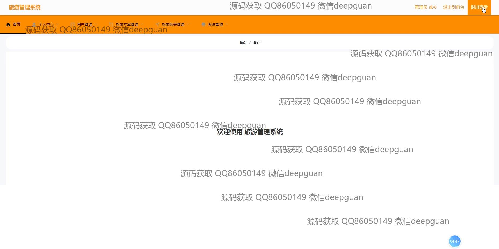

<h1 align="center">的旅游管理</h1>

## 简介
旅游管理系统：角色分为管理员、用户；提供用户注册登录、旅游方案管理、用户管理、旅游订单与购买管理、评价系统等功能，界面简洁直观，提升用户体验与管理效率。    --计算机毕业设计源码；毕设源码；java毕业设计源码

## 联系方式

<h3 align="center">获取完整代码与数据库文件 + 微信：deepguan QQ: 86050149 QQ群: 783742310</h3>

<h3 align="center">可帮忙远程部署 包运行成功！提供远程部署、修改代码、设计文档指导、代码讲解等服务！</h3>

## 功能介绍（完整见运行截图）
管理员：基本功能包括登录、注册和退出。用户管理涵盖查看、编辑和删除用户信息，支持头像上传。可进行旅游方案管理，包括方案创建、编辑、删除和图片上传。系统管理模块提供各类旅游产品和订单的管理工具，支持在线支付。界面简洁直观，导航栏便捷，角色可直接访问后台功能以处理订单和管理员操作。

用户：基本功能包括登录和注册。可通过界面查看和选择合适的旅游产品，显示详细信息如价格、行程和用户评价。提供个人中心供用户管理个人信息、查看订单历史和修改、取消订单。支持旅游方案浏览与购买，方案详情页允许查看、评论，且支持富文本编辑和详情图像上传。用户导航方便，模块划分清晰，预定流程直观简单。

## 运行截图

本代码来源于网络,仅供学习参考使用!

